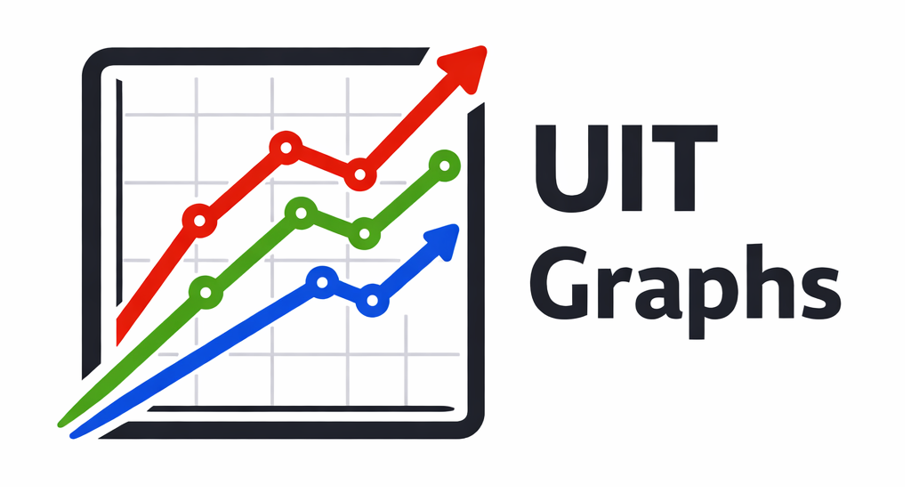

## About Me

I'm a software developer with a strong academic background, currently focused on simulations, game physics, and tools for Unity.
I enjoy combining programming, mathematics, and physics to build efficient and practical solutions for real-time applications.

In my free time, I actively develop and maintain several Unity projects:

 

  <a href="https://assetstore.unity.com/packages/tools/gui/uit-graphs-374468">
  <picture>
    <source media="(prefers-color-scheme: dark)" srcset="assets/uit-graphs-logo-dark.png">
    <source media="(prefers-color-scheme: light)" srcset="assets/uit-graphs-logo-light.png">
    
  </picture>
  </a>

  <strong><a href="https://assetstore.unity.com/packages/tools/gui/uit-graphs-374468">UIT Graphs</a></strong> — graph plotting package available on the Unity Asset Store. The package is inspired by industry-standard plotting tools such as gnuplot and matplotlib, and allows you to create graphs both at runtime and in the Unity Editor.

 

 
 

  <a href="https://github.com/andywiecko/BurstTriangulator">
  <picture>
    <source media="(prefers-color-scheme: dark)" srcset="assets/burst-triangulator-logo-dark.svg">
    <source media="(prefers-color-scheme: light)" srcset="assets/burst-triangulator-logo-light.svg">
    
  </picture>
  </a>
  
  <strong><a href="https://github.com/andywiecko/BurstTriangulator">Burst Triangulator</a></strong> — an efficient Unity Delaunay triangulation package with support for constraints and refinement.

 

 
 
 

My primary interests include:

- Simulation
- Game Physics
- Computer Graphics

I value minimalism and simplicity in both design and code, striving to create efficient solutions without unnecessary complexity.

Sometimes I write technical posts on my [blog] ✍️

 

_Last edited: 27/09/2026_

[blog]: https://andywiecko.github.io/blog
